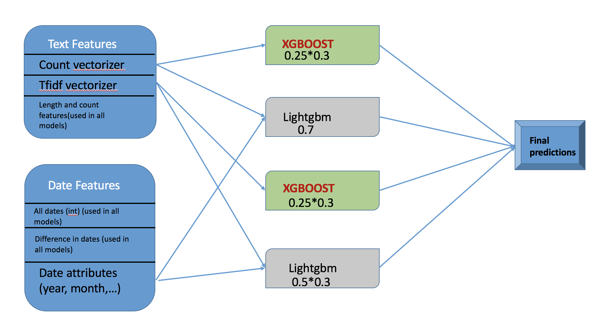

# HackerEarth [Machine Learning challenge #2 competition](https://www.hackerearth.com/challenge/competitive/machine-learning-challenge-2/)

##### Participated as ziron
##### This code scored Rank 5 on the private leaderboard
##### [Leaderboard](https://www.hackerearth.com/challenge/competitive/machine-learning-challenge-2/leaderboard/)

### Folder structure
├── input 
│   ├── samplesubmission.csv 
│   ├── test.csv 
│   ├── test_count.npz 
│   ├── test_tfidf.npz 
│   ├── train.csv 
│   ├── train_count.npz 
│   └── train_tfidf.npz 
├── src 
│   ├── ensemble.py 
│   ├── ml2_lgbm_count_vectorizer.py 
│   ├── ml2_lgbm_tfidf_vectorizer.py 
│   ├── ml2_xgb_count_vectorizer.py 
│   ├── ml2_xgb_tfidf_vectorizer.py 
├── submissions 
│   ├── ML2_SupreethManyam.csv 
│   ├── submit_lgbm_count_prob.csv 
│   ├── submit_lgbm_tfidf_prob.csv 
│   ├── submit_xgb_count_prob.csv 
│   └── submit_xgb_tfidf_prob.csv 

## Approach and Feature Engineering:

Projects were observed to have a clear trend with date and the most common words used in the name and the description of the project. Final submission is the ensemble (weighted average) of four models consisting of 2 xgboost (bagged 8 times) and 2 lightgbm (bagged 8 times).

Types of features:
1. Date features
2. Text features

<table border="1" class="dataframe">
  <thead>
    <tr style="text-align: right;">
      <th></th>
      <th>final_status_xgb_count</th>
      <th>final_status_xgb_tfidf</th>
      <th>final_status_lgbm_count</th>
      <th>final_status_lgbm_tfidf</th>
    </tr>
  </thead>
  <tbody>
    <tr>
      <th>final_status_xgb_count</th>
      <td>1.000000</td>
      <td>0.991923</td>
      <td>0.944424</td>
      <td>0.950756</td>
    </tr>
    <tr>
      <th>final_status_xgb_tfidf</th>
      <td>0.991923</td>
      <td>1.000000</td>
      <td>0.941248</td>
      <td>0.955602</td>
    </tr>
    <tr>
      <th>final_status_lgbm_count</th>
      <td>0.944424</td>
      <td>0.941248</td>
      <td>1.000000</td>
      <td>0.969848</td>
    </tr>
    <tr>
      <th>final_status_lgbm_tfidf</th>
      <td>0.950756</td>
      <td>0.955602</td>
      <td>0.969848</td>
      <td>1.000000</td>
    </tr>
  </tbody>
</table>

## Tools used:
1. python - 3.6.1
2. xgboost - 0.6
3. lightgbm - 0.2
4. sklearn - 0.18.1
5. pandas - 0.20.1
6. numpy - 1.12.1
7. scipy - 0.19.0
